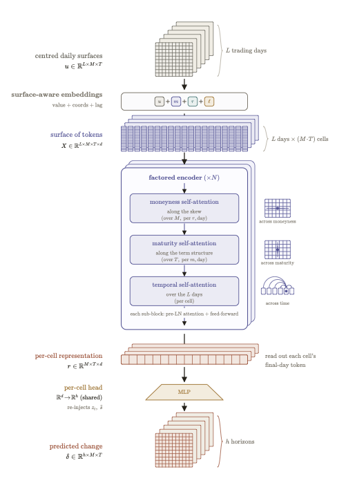
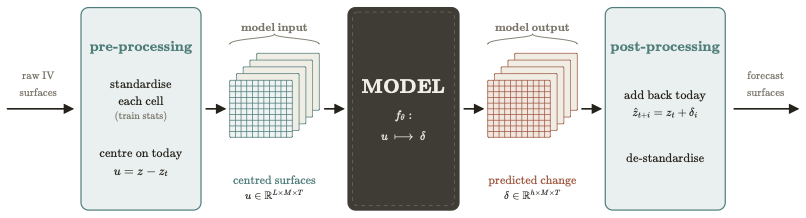

# High-Dimensional Financial Data Analysis with Tensor Attention-Based Neural Networks

**MEng final-year thesis — Electronic & Information Engineering, Imperial College London (2026)**
Ioannis P. Zioulis · Supervisor: Prof. Danilo Mandic · Second marker: Prof. Cong Ling

📄 [Thesis](final_year_project.pdf) · 🖥️ [Slides](fyp_pres.pptx)

<p align="center">
  
</p>

## Abstract

The implied-volatility (IV) surface is central to hedging and risk management, both of which
depend more on how the surface *moves* than on where it sits today — yet direct multi-step
forecasting of the full surface from its own history is under-addressed. This project forecasts
the S&P 500 IV surface several horizons ahead and asks whether respecting its structure improves
forecasts. A smoothed surface dataset is built from two decades of option quotes, and a ladder of
models is evaluated at matched capacity — from a linear baseline, through plain transformers, to
the proposed **Surface-Aware Neural Tensor Attention (SANTA)** — benchmarked against a persistence
null and a polynomial-coefficient vector autoregression. SANTA tokenises each surface cell, adds
learned moneyness and maturity coordinate embeddings, and applies factored axial attention across
moneyness, maturity, and time. Its edge is clearest on cross-sectional shape (rank correlation) at
the longer horizons, and ablations trace that gain to the surface-aware coordinate embeddings more
than to spatial attention.

This repository holds the models, the shared training/evaluation harness, and the
data-preprocessing pipeline.

## Overview

The surface is a grid of **110 cells** (11 log-forward-moneyness × 10 maturities). Each
model takes a window of `L = 63` trading days of standardised log-IV and predicts the
surface at horizons `h ∈ {1, 5, 10, 21, 42, 63}` days ahead.

All models share one forecasting contract:

<p align="center">
  
</p>

Training minimises a uniform MSE on the standardised change (`surface_loss`); per-cell
standardisation upstream supplies the implicit variance weighting. The train/val/test
split is chronological by window-end position (70/10/20 by default), and every window's
whole forecast horizon stays within a single split, so no window forecasts a day from
another split.

## Models

| Name | Folder | Description |
|------|--------|-------------|
| `santa` | `SANTA/` | **Surface-Aware Neural Tensor Attention** — factored axial attention over moneyness, maturity, and time, with learned coordinate embeddings. |
| `santa_flat` | `SANTA_flat/` | Joint-spatial ablation: one attention block over all M·T cells, then temporal. |
| `santa_temporal` | `SANTA_temporal/` | Temporal-only ablation: both spatial blocks removed. |
| `per_cell_transformer` | `per_cell_transformer/` | SANTA-Temporal backbone without the coordinate embeddings. |
| `transformer` | `transformer/` | Day-token encoder baseline (flattened surface per day). |
| `nlinear` | `NLinear/` | One shared linear map on the centred lookback — the simplest floor. |
| `var` | `VAR/` | Gonçalves–Guidolin two-stage: daily cross-sectional OLS on the basis `[1, M, M², τ, Mτ]`, then a BIC-selected VAR on the 5 coefficients. |

The six deep models share the same trainer (AdamW, grad-clip 1.0, MSE, early stopping on
validation) and are sized to a common ~44–51k parameter envelope so comparisons isolate
architecture rather than capacity. VAR has no training loop.

## Repository layout

```
train.py                  entry point — train/evaluate any model

surface_core.py           shared framework: Config, attention primitives instance-norm, loss, windowing

embeddings.py             coordinate embeddings

SANTA/ … VAR/             one folder per model: <model>.py + eval/ results

_data_prep/               OptionMetrics preprocessing

_diagrams/                architecture diagrams (PDF)

requirements.txt
```

## Installation

Requires **Python 3.10+**.

```bash
pip install -r requirements.txt
```

## Data

The models expect a single CSV with a `date` column and one column per surface cell named
`iv_{moneyness}_{tau}` — e.g. `iv_-0.1_0.0822` — in **decimal implied volatility**. The
columns parse into a (tau × moneyness) grid (tau-outer, moneyness-inner); the trainer takes
logs and fits a per-channel standardiser on the training rows only.

The surfaces used in the project are derived from OptionMetrics / IvyDB SPX quotes,
which are licensed data and are **not redistributed here**. 

To reproduce them, point
`_data_prep/preprocess_optionmetrics.py` at your own OptionMetrics export — it builds each
daily surface as a vega-weighted Nadaraya–Watson smooth of OTM + narrow-ATM quotes on the
`(log τ, log K/F)` grid and writes `SPX_surfaces.csv`. Any CSV following the column format
above works with `--csv_path`.

## Usage

Train a single model at one horizon:

```bash
python train.py --model santa --pred_len 21
```

Train all six deep models sequentially, or the VAR baseline explicitly:

```bash
python train.py --model all --pred_len 21
python train.py --model var --pred_len 21
```

Key arguments:

| Flag | Default | Notes |
|------|---------|-------|
| `--model` | *(required)* | one of the names above, or `all` (deep models only) |
| `--pred_len` | *(required)* | `1`, `5`, `10`, `21`, `42`, or `63` |
| `--csv_path` | `SPX_surfaces.csv` | path to the surfaces CSV |
| `--train_frac` / `--val_frac` | `0.7` / `0.1` | chronological split fractions (test = remainder) |
| `--data_end` | `2023-12-29` | drop rows after this date; `none` keeps all |
| `--seed` | `42` | |
| `--batch_size` | `64` | |

## Outputs

Each run writes to `<Model>/eval/63_<pred_len>/seed_<seed>/` (VAR: `VAR/eval/63_<pred_len>/`):

- `metrics_test.json` — test MSE / RMSE / MAE in standardised log-IV
- `hyperparams.json` — resolved config, grid, and the scaler
- `best_model.pt`, `train_log.csv` — deep models
- `preds.npy` — VAR (deterministic)

## Diagrams

Architecture figures live in `_diagrams/`:
[SANTA](_diagrams/santa.pdf) ·
[SANTA-Flat](_diagrams/santa_flat.pdf) ·
[SANTA-Temporal](_diagrams/santa_temporal.pdf) ·
[per-cell transformer](_diagrams/per_cell.pdf) ·
[vanilla transformer](_diagrams/vanilla.pdf) ·
[coordinate embeddings](_diagrams/sa_embeddings.pdf).

## License

No `LICENSE` file is included yet. Add one on GitHub via *Add file → Create new file*,
name it `LICENSE`, and pick a template (e.g. MIT).
